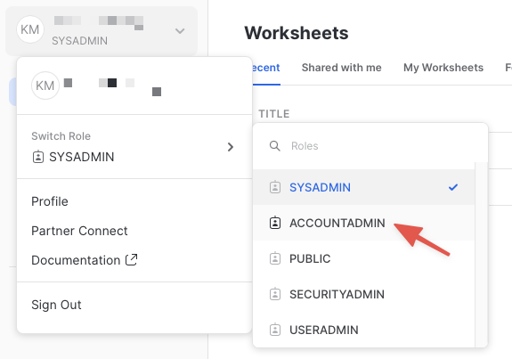
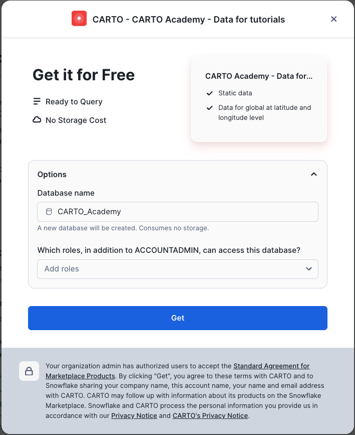
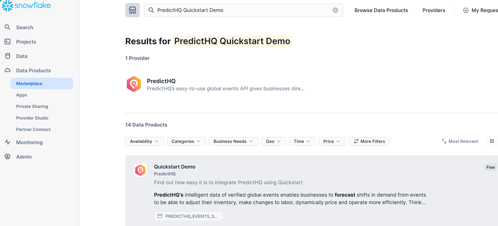
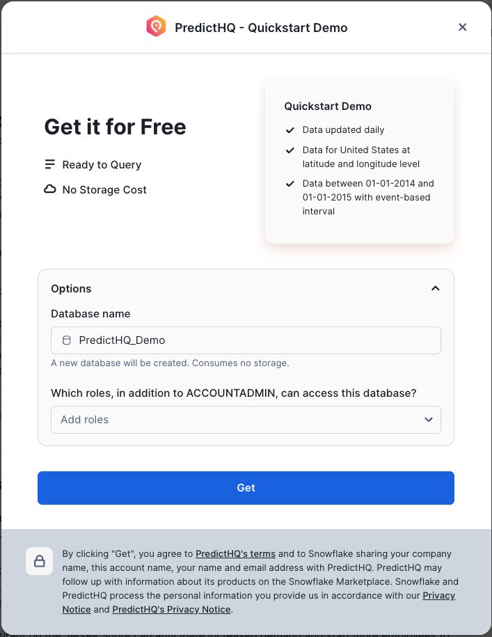
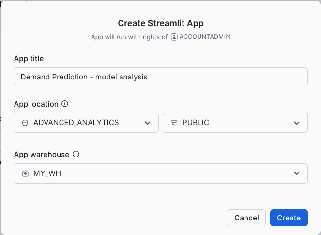
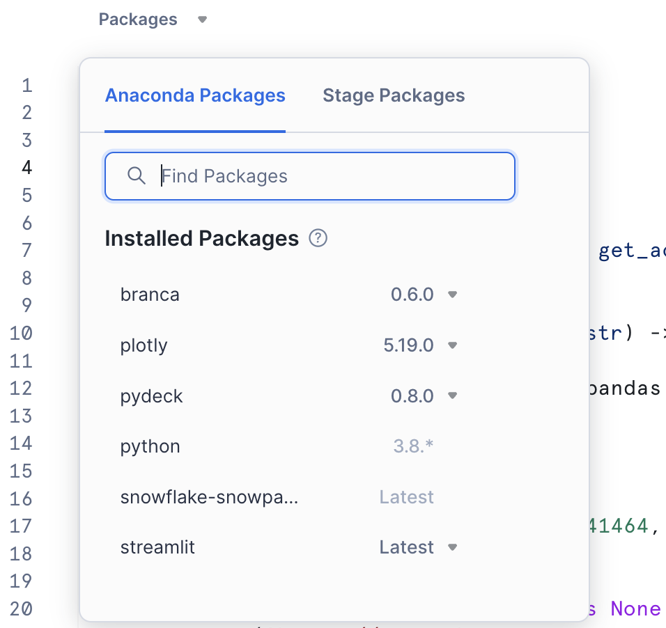
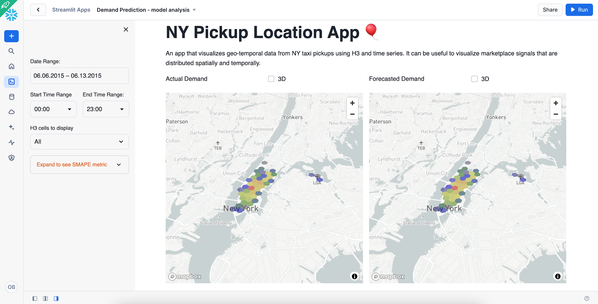
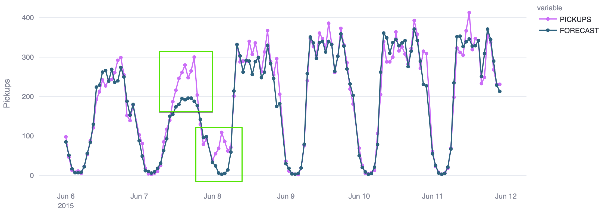

# Getting Started with Geospatial Hands-On Practice

Snowflake offers a rich toolkit for predictive analytics with a geospatial component. It includes two data types and specialized functions for transformation, prediction, and visualization. This guide is divided into multiple labs, each covering a separate use case that showcases different features for a real-world scenario.

Helpful Supporting Documents:

  * Understanding of Discrete Global Grid H3
  * Understanding of Geospatial Data Types and Geospatial Functions in Snowflake
  * Geospatial Analysis using Geometry Data Type Quickstart
  * ​Performance Optimization Techniques for Geospatial queries Quickstart

## Setup your Account

## Set Your Account Permission

Switch your current role from the default SYSADMIN to ACCOUNTADMIN . This increase in permissions will allow you to create shared databases from Snowflake Marketplace listings.



## Create a Virtual Warehouse

You will need to create a Virtual Warehouse to run queries.

```sql
use role accountadmin;

CREATE WAREHOUSE IF NOT EXISTS MY_WH
    WAREHOUSE_SIZE = 'LARGE'
    AUTO_RESUME = true
    AUTO_SUSPEND = 60
    ENABLE_QUERY_ACCELERATION = false
    WAREHOUSE_TYPE = 'STANDARD'
    MIN_CLUSTER_COUNT = 1
    MAX_CLUSTER_COUNT = 1
    SCALING_POLICY = 'STANDARD';

USE WAREHOUSE my_wh;
```
Create a new database and schema where you will store datasets in the GEOMETRY data type.

```sql
CREATE or Replace Database advanced_analytics;
-- Set the working database schema
USE advanced_analytics.public;
ALTER SESSION SET GEOGRAPHY_OUTPUT_FORMAT = 'WKT';
ALTER SESSION SET USE_CACHED_RESULT = FALSE;
```

### Set up DORA grading in your demo account (if you haven’t already done so

# Forecasting time series on a map

In this lab, we aim to show you how to predict the number of trips in the coming hours in each area of New York. To accomplish this, you will ingest the raw data and then aggregate it by hour and region. For simplicity, you will use [Discrete Global Grid H3](https://www.uber.com/en-DE/blog/h3/). The result will be an hourly time series, each representing the count of trips originating from distinct areas. Before running prediction and visualizing results, you will enrich data with third-party signals, such as information about holidays and offline sports events.

In this lab you will learn how to:

  * Work with geospatial data
  * Enrich data with new features
  * Predict time-series of complex structure

This approach is not unique to trip forecasting but is equally applicable in various scenarios where predictive analysis is required. Examples include forecasting scooter or bike pickups, food delivery orders, sales across multiple retail outlets, or predicting the volume of cash withdrawals across an ATM network. Such models are invaluable for planning and optimization across various industries and services.

## Step 1. Data acquisition

The New York Taxi and Limousine Commission (TLC) has provided detailed, anonymized customer travel data since 2009. Painted yellow cars can pick up passengers in any of the city's five boroughs. Raw data on yellow taxi rides can be found on the TLC website . This data is divided into files by month. Each file contains detailed trip information, you can read about it here . For our project, you will use an NY Taxi dataset for the 2014-2015 years from the CARTO Academy Marketplace listing.

  * Navigate to the Marketplace screen using the menu on the left side of the window
  * Search for `CARTO Academy` in the search bar
  * Find and click the `CARTO Academy - Data for tutorials` tile
  * Once in the listing, click the big blue `Get` button

Change the name of the database from the default to Carto\_Academy , as all future instructions will assume this name for the database.



Another dataset you will use is events data, which you can also get from the Snowflake Marketplace. It is provided by PredictHQ and called PredictHQ Quickstart Demo.

  * Search for `PredictHQ Quickstart Demo` in the search bar
  * Find and click the `Quickstart Demo` tile



  * On the Get Data screen, change the name of the database from the default to PredictHQ\_Demo .



## Step 2. Data transformation

In this step, you'll divide New York into uniformly sized regions and assign each taxi pick-up location to one of these regions. We aim to get a table with the number of taxi trips per hour for each region.

To achieve this division, you will use the Discrete Global Grid H3. H3 organizes the world into a grid of equal-sized hexagonal cells, with each cell identified by a unique code (either a string or an integer). This hierarchical grid system allows cells to be combined into larger cells or subdivided into smaller ones, facilitating efficient geospatial data processing.

H3 offers 16 different resolutions for dividing areas into hexagons, ranging from resolution 0, where the world is segmented into 122 large hexagons, to resolution 15. At this resolution, each hexagon is less than a square meter, covering the world with approximately 600 trillion hexagons. You can read more about resolutions [here](https://h3geo.org/docs/core-library/restable/) . For our task, we will use resolution 8, where the size of each hexagon is about 0.7 sq. km (0.3 sq. miles).

As a source of the trips data you will use `TLC_YELLOW_TRIPS_2014` and `TLC_YELLOW_TRIPS_2015` tables from the CARTO listing. We are interested in the following fields:

  * Pickup Time
  * Dropoff Time
  * Distance
  * Pickup Location
  * Dropoff Location
  * Total Amount

First, specify the default Database, Schema and the Warehouse:

```sql
USE advanced_analytics.public;
USE WAREHOUSE my_wh;
```

Since CARTO's TABLE s contain raw data you might want to clean it before storing. In the following query you will do a few data cleaning steps:

  * Remove rows that are outside of latitude/longitude allowed values
  * Keep only trips with a duration longer than one minute and distances more than 10 meters.

Since you are interested in trip data for 2014 and 2015 you need to union `TLC_YELLOW_TRIPS_2014` and `TLC_YELLOW_TRIPS_2015` tables. On average, the execution time on the LARGE warehouse is under 4 minutes.

```sql
/*
Use a Common Table Expression (CTE) to combine the raw trip data from both the 2014 and 2015 tables into a single source.
*/
WITH all_trips AS (
    SELECT * FROM CARTO_ACADEMY.CARTO.TLC_YELLOW_TRIPS_2014
    UNION ALL
    SELECT * FROM CARTO_ACADEMY.CARTO.TLC_YELLOW_TRIPS_2015
)

/*
Create the final table by selecting from the combined data, applying transformations and filters only once.
*/
CREATE OR REPLACE TABLE advanced_analytics.public.ny_taxi_rides AS
SELECT
    -- Convert timestamps from UTC to New York time
    CONVERT_TIMEZONE('UTC', 'America/New_York', TO_TIMESTAMP(PICKUP_DATETIME::VARCHAR)) AS PICKUP_TIME,
    CONVERT_TIMEZONE('UTC', 'America/New_York', TO_TIMESTAMP(DROPOFF_DATETIME::VARCHAR)) AS DROPOFF_TIME,

    -- Create GEOGRAPHY point objects for locations
    ST_POINT(PICKUP_LONGITUDE, PICKUP_LATITUDE)   AS PICKUP_LOCATION,
    ST_POINT(DROPOFF_LONGITUDE, DROPOFF_LATITUDE) AS DROPOFF_LOCATION,

    -- Include trip distance and total amount
    trip_distance,
    total_amount
FROM
    all_trips
WHERE
    -- Filter for valid latitude and longitude coordinates
    pickup_latitude BETWEEN -90 AND 90
    AND dropoff_latitude BETWEEN -90 AND 90
    AND pickup_longitude BETWEEN -180 AND 180
    AND dropoff_longitude BETWEEN -180 AND 180

    -- Filter for trips with a meaningful distance and duration
    AND ST_DISTANCE(ST_POINT(PICKUP_LONGITUDE, PICKUP_LATITUDE), ST_POINT(DROPOFF_LONGITUDE, DROPOFF_LATITUDE)) > 10
    AND TIMEDIFF(MINUTE, TO_TIMESTAMP(PICKUP_DATETIME::VARCHAR), TO_TIMESTAMP(DROPOFF_DATETIME::VARCHAR)) > 1;
```

Now you will create a table where, for each pair of timestamp/H3, we calculate the number of trips. You will strip off minutes and seconds and keep only hours.

```sql
CREATE OR REPLACE TABLE advanced_analytics.public.ny_taxi_rides_h3 AS
    SELECT TIME_SLICE(pickup_time, 60, 'minute', 'START') AS pickup_time,
        H3_POINT_TO_CELL_string(pickup_location, 8) AS h3,
        count(*) AS pickups
        FROM advanced_analytics.public.ny_taxi_rides
        GROUP BY 1, 2;
```

Since on resolution 8, you might have more than 1000 hexagons for New York, to speed; up the training process, you will keep only hexagons that had more than 1M pickups in 2014. This is shown in the following code block.

```sql
CREATE OR REPLACE TABLE advanced_analytics.public.ny_taxi_rides_h3 AS
-- Use a Common Table Expression (CTE) to find the hexagons with a high volume of pickups
WITH all_hexagons AS (
    SELECT
        h3,
        SUM(pickups) AS total_pickups
    FROM
        advanced_analytics.public.ny_taxi_rides_h3
    WHERE
        YEAR(pickup_time) = 2014
    GROUP BY
        h3
)
-- Select all original data for the hexagons identified in the CTE
SELECT
    t1.*
FROM
    advanced_analytics.public.ny_taxi_rides_h3 AS t1
    INNER JOIN all_hexagons AS t2 ON t1.h3 = t2.h3
WHERE
    t2.total_pickups >= 1000000;
```

It's important to remember that if the raw data lacks records for a specific hour and area combination, the aggregated data for that period should be marked as 0. This step is crucial for accurate time series prediction. Run the following query to add records indicating that there were zero trips for any H3 location and timestamp pair without recorded trips.

```sql
CREATE OR REPLACE TABLE advanced_analytics.public.ny_taxi_rides_h3 AS

-- Use a Common Table Expression (CTE) to generate a complete timeline
-- for every unique hexagon.
WITH all_dates_hexagons AS (
    SELECT
        -- Generate a continuous series of hourly timestamps from 2014 to 2015
        DATEADD(
            HOUR,
            VALUE::int,
            '2014-01-01'::timestamp
        ) AS pickup_time,
        h3
    FROM
        -- This generates a sequence of numbers for every hour in the 2-year range
        TABLE(FLATTEN(ARRAY_GENERATE_RANGE(0, DATEDIFF('hour', '2014-01-01', '2015-12-31 23:59:00') + 1)))
        -- Cross join with every unique hexagon to create a complete placeholder table
        CROSS JOIN (
            SELECT DISTINCT
                h3
            FROM
                advanced_analytics.public.ny_taxi_rides_h3
        )
)

-- Join the complete placeholder data with the actual pickup data
SELECT
    t1.pickup_time,
    t1.h3,
    -- If a matching record exists in the original table, use its pickup count.
    -- Otherwise, default to 0. (Corrected from 'IF F' to 'IFF')
    IFF(t2.pickups IS NOT NULL, t2.pickups, 0) AS pickups
FROM
    all_dates_hexagons AS t1
    LEFT JOIN advanced_analytics.public.ny_taxi_rides_h3 AS t2
        ON t1.pickup_time = t2.pickup_time AND t1.h3 = t2.h3;
```

## Step 3. Data Enrichment

In this step, you will enhance our dataset with extra features that could improve the accuracy of our predictions. The Cortex model for time series automatically encodes days of the week as a separate feature, but it makes sense to consider that public or school holidays could affect the demand for taxi services. Likewise, areas hosting sporting events might experience a surge in taxi pickups. To incorporate this insight, you will use data from [PredictHQ - Quickstart Demo](https://app.snowflake.com/marketplace/listing/GZSTZ3TGTNLQM/predicthq-quickstart-demo) listing, which provides information on events in New York for the years 2014-2015.

Run the following query to enrich the data with holiday, and event information. For sports events, you will include only those with a high rank.

```sql
CREATE OR REPLACE TABLE advanced_analytics.public.ny_taxi_rides_h3 AS
SELECT
    t1.*,
    -- Add a column for school holidays
    IFF(
        t2.category = 'school-holidays',
        'school-holidays',
        'None'
    ) AS school_holiday,
    -- Add a column for public holidays, listing the specific holiday names
    IFF(
        t3.category = 'public-holidays',
        ARRAY_TO_STRING(t3.labels, ', '),
        'None'
    ) AS public_holiday,
    -- Add a column for the specific type of sports event
    IFF(
        t4.category = 'sports',
        t4.labels[0]::string,
        'None'
    ) AS sport_event
FROM
    advanced_analytics.public.ny_taxi_rides_h3 AS t1
    -- Join to find school holidays in New York
    LEFT JOIN (
        SELECT DISTINCT
            title,
            category,
            event_start,
            event_end,
            labels
        FROM
            PREDICTHQ_DEMO.PREDICTHQ.PREDICTHQ_EVENTS_SNOWFLAKE_SUMMIT_2024
        WHERE
            category = 'school-holidays' AND title ILIKE 'New York%'
    ) AS t2
        ON DATE(t1.pickup_time) BETWEEN t2.event_start AND t2.event_end
    -- Join to find national public holidays
    LEFT JOIN (
        SELECT DISTINCT
            title,
            category,
            event_start,
            event_end,
            labels
        FROM
            PREDICTHQ_DEMO.PREDICTHQ.PREDICTHQ_EVENTS_SNOWFLAKE_SUMMIT_2024
        WHERE
            ARRAY_CONTAINS('holiday-national'::variant, labels)
    ) AS t3
        ON DATE(t1.pickup_time) BETWEEN t3.event_start AND t3.event_end
    -- Join to find high-ranking sports events happening at the same time and location
    LEFT JOIN (
        SELECT
            *
        FROM
            PREDICTHQ_DEMO.PREDICTHQ.PREDICTHQ_EVENTS_SNOWFLAKE_SUMMIT_2024
        WHERE
            phq_rank > 70 AND category = 'sports'
    ) AS t4
        ON t1.pickup_time = DATE_TRUNC('hour', t4.event_start)
        AND t1.h3 = H3_POINT_TO_CELL_STRING(t4.geo, 8);
```

## Step 4. Training and Prediction

In this step, you'll divide our dataset into two parts: the Training set and the Prediction set. The Training set will be used to train our machine learning model. It will include data from the entirety of 2014 and part of 2015, going up to June 5th, 2015. Run the following query to create the Training set:

```sql
CREATE OR REPLACE TABLE advanced_analytics.public.ny_taxi_rides_h3_train AS
SELECT
    *
FROM
    advanced_analytics.public.ny_taxi_rides_h3
WHERE
    DATE(pickup_time) < DATE('2015-06-05 12:00:00');
```

The prediction set, on the other hand, will contain data for one week starting June 5th, 2015. This setup allows us to make predictions on data that wasn't used during training.

```sql
CREATE OR REPLACE TABLE advanced_analytics.public.ny_taxi_rides_h3_predict AS
SELECT
    h3,
    pickup_time,
    SCHOOL_HOLIDAY,
    PUBLIC_HOLIDAY,
    SPORT_EVENT
FROM
    advanced_analytics.public.ny_taxi_rides_h3
WHERE
    DATE(pickup_time) >= DATE('2015-06-05')
    AND DATE(pickup_time) < DATE('2015-06-12');
```

Now that you have the Training and Prediction SETs, you can run your model training step. In this step, you will use Snowflake's Cortex ML Forecasting function to train your `ny_taxi_rides_model` . You're telling the function it should train on `ny_taxi_rides_h3_train`– and that this table contains data for multiple distinct time series ( `series_colname =>‘h3'`), one for each h3 in the table. The function will now automatically train one machine learning model for each h3. Note that you are also telling the model which column in our table to use as a timestamp and which column to treat as our "target" (i.e., the column you want to forecast). On average the query below completes in about 7 minutes on the LARGE warehouse though we have seen it take as long as 30 minutes.

```sql
CREATE OR REPLACE SNOWFLAKE.ML.FORECAST ny_taxi_rides_model(
    INPUT_DATA => SYSTEM$REFERENCE('TABLE', 'advanced_analytics.public.ny_taxi_rides_h3_train'),
    SERIES_COLNAME => 'h3',
    TIMESTAMP_COLNAME => 'pickup_time',
    TARGET_COLNAME => 'pickups'
);
```

Now you will predict the "future" demand for one week of test data. Run the following command to forecast demand for each H3 cell ID and store your results in the "forecasts" table.

Similar to what you did in the training step, you specify the data the model should use to generate its forecasts (`ny_taxi_rides_h3_predict`) and indicate which columns to use for identifying unique H3 and for timestamps.

```sql
BEGIN
    -- Step 1: Call the forecasting model with the input data and configuration.
    CALL ny_taxi_rides_model!FORECAST(
        INPUT_DATA => SYSTEM$REFERENCE('TABLE', 'advanced_analytics.public.ny_taxi_rides_h3_predict'),
        SERIES_COLNAME => 'h3',
        TIMESTAMP_COLNAME => 'pickup_time',
        CONFIG_OBJECT => {'prediction_interval': 0.95}
    );

    -- Step 2: Capture the ID of the last query (the model call) to reference its results.
    LET query_id := SQLID;

    -- Step 3: Create a new table to store the cleaned forecast results.
    CREATE OR REPLACE TABLE advanced_analytics.public.ny_taxi_rides_model_forecast AS
    SELECT
        series::STRING AS h3,
        ts AS pickup_time,

        -- Ensure forecast values are not negative, defaulting to 0 if they are.
        CASE
            WHEN forecast < 0 THEN 0
            ELSE forecast
        END AS forecast,

        -- Ensure the lower prediction bound is not negative.
        CASE
            WHEN lower_bound < 0 THEN 0
            ELSE lower_bound
        END AS lower_bound,

        -- Ensure the upper prediction bound is not negative.
        CASE
            WHEN upper_bound < 0 THEN 0
            ELSE upper_bound
        END AS upper_bound
    FROM
        TABLE(RESULT_SCAN(:query_id));
END;
```

Create a table with predicted and actual results:

```sql
CREATE OR REPLACE TABLE advanced_analytics.public.ny_taxi_rides_compare AS
SELECT
    t1.h3,
    t1.pickup_time,
    t2.pickups,
    -- Round the forecasted value to the nearest whole number
    ROUND(t1.forecast, 0) AS forecast
FROM
    -- This table contains the output from the forecasting model
    advanced_analytics.public.ny_taxi_rides_model_forecast AS t1
    -- Join back to the original table to get the actual pickup counts
    INNER JOIN advanced_analytics.public.ny_taxi_rides_h3 AS t2
        ON t1.h3 = t2.h3
        AND t1.pickup_time = t2.pickup_time;
```

Now you will generate evaluation metrics and store them in the `ny_taxi_rides_metrics` table:

```sql
BEGIN
    -- First, call the method to show the model's evaluation metrics
    CALL ny_taxi_rides_model!show_evaluation_metrics();

    -- Capture the ID of the previous SQL statement (the CALL command)
    LET sql_id := SQLID;

    -- Create a new table to store the metrics
    CREATE OR REPLACE TABLE advanced_analytics.public.ny_taxi_rides_metrics AS
    SELECT
        series::string AS h3, -- The series identifier, cast to a string
        metric_value,         -- The calculated value of the metric
        error_metric          -- The name of the error metric (e.g., 'MAPE', 'RMSE')
    FROM
        -- Use the RESULT_SCAN function to query the results of the previous CALL command
        TABLE(RESULT_SCAN(:sql_id));
END;
```

The table `ny_taxi_rides_metrics` contains various metrics; please review what is available in the table. You should select a metric that allows uniform comparisons across all hexagons to understand the model's performance in each hexagon. Since trip volumes may vary among hexagons, the chosen metric should not be sensitive to absolute values. The Symmetric Mean Absolute Percentage Error ([SMAPE](https://en.wikipedia.org/wiki/Symmetric_mean_absolute_percentage_error)) would be a suitable choice. Create a table with the list of hexagons and the SMAPE value for each:

```sql
CREATE OR REPLACE TABLE
advanced_analytics.public.ny_taxi_rides_metrics AS
SELECT h3, metric_value AS smape
FROM advanced_analytics.public.ny_taxi_rides_metrics
    WHERE error_metric::string = 'SMAPE'
        Order by 2 Asc;
```

## Step 5. Visualization and analysis

In this step, you will visualize the actual and predicted results and consider how you can improve our model. Open `Projects > Streamlit > + Streamlit App`. Give the new app a name, for example `Demand Prediction - model analysis` , and pick `ADVANCED_ANALYTICS.PUBLIC` as an app location.



Click on the packages tab and add `pydeck`, `branca` and `plotly` to the list of packages as our app will be using them.



Then copy-paste the following code to the editor and click `Run` :

```python
# ==============================================================================
# 1. IMPORTS
# ==============================================================================
import datetime
import pandas as pd
import plotly.express as px
import pydeck as pdk
import streamlit as st
import branca.colormap as cm
from snowflake.snowpark.context import get_active_session


# ==============================================================================
# 2. CONFIGURATION & CONSTANTS
# ==============================================================================
# --- Page Config ---
st.set_page_config(
    layout="wide",
    initial_sidebar_state="expanded",
    page_title="NY Taxi Pickup Analysis"
)

# --- SQL Queries ---
# Using f-strings with placeholders for dynamic parts
BASE_QUERY_TEMPLATE = """
    SELECT {h3_column}, {agg_function}({metric}) AS COUNT
    FROM advanced_analytics.public.ny_taxi_rides_compare
    WHERE
        pickup_time BETWEEN DATE('{start_date}') AND DATE('{end_date}')
        AND TIME(pickup_time) BETWEEN '{start_time}' AND '{end_time}'
    GROUP BY 1
"""

TIME_SERIES_QUERY = "SELECT pickup_time, h3, forecast, pickups FROM advanced_analytics.public.ny_taxi_rides_compare"
METRICS_QUERY = "SELECT * FROM advanced_analytics.public.ny_taxi_rides_metrics"
AVG_COORDINATE_QUERY = "SELECT AVG(ST_Y(H3_CELL_TO_POINT(h3))) AS lat, AVG(ST_X(h3_cell_to_point(h3))) AS lon FROM advanced_analytics.public.ny_taxi_rides_compare"

# --- Constants ---
COLOR_PALETTE = ["gray", "blue", "green", "yellow", "orange", "red"]


# ==============================================================================
# 3. DATA & HELPER FUNCTIONS
# ==============================================================================
@st.cache_data
def load_data(query: str) -> pd.DataFrame:
    """Executes a SQL query and returns a pandas DataFrame."""
    session = get_active_session()
    return session.sql(query).to_pandas()

def generate_color_map(df: pd.DataFrame, count_col: str = "COUNT") -> pd.DataFrame:
    """
    Generates quantiles and applies a color map to the DataFrame.

    Args:
        df (pd.DataFrame): DataFrame with a count column.
        count_col (str): The name of the column containing counts.

    Returns:
        pd.DataFrame: DataFrame with an added 'COLOR' column.
    """
    if df is None or df.empty:
        return df

    quantiles = df[count_col].quantile([0, 0.25, 0.5, 0.75, 1])
    linear_map = cm.LinearColormap(
        COLOR_PALETTE,
        vmin=quantiles.min(),
        vmax=quantiles.max(),
        index=quantiles
    )
    df["COLOR"] = df[count_col].apply(linear_map.rgb_bytes_tuple)
    return df


# ==============================================================================
# 4. UI & CHARTING FUNCTIONS
# ==============================================================================
def render_sidebar(metrics_df: pd.DataFrame) -> tuple:
    """Renders the sidebar and returns user selections."""
    with st.sidebar:
        st.header("Filters")

        # --- Date and Time Selection ---
        initial_start_date = datetime.date(2015, 6, 6)
        selected_date_range = st.date_input(
            "Date Range:",
            (initial_start_date, initial_start_date + datetime.timedelta(days=7)),
            format="MM.DD.YYYY",
        )

        time_col1, time_col2 = st.columns(2)
        with time_col1:
            start_time = st.time_input("Start Time", datetime.time(0, 0), step=3600)
        with time_col2:
            end_time = st.time_input("End Time", datetime.time(23, 0), step=3600)

        # --- H3 Cell Selection ---
        h3_options = ["All"] + metrics_df["H3"].to_list()
        selected_h3 = st.selectbox("H3 Cell to Display:", h3_options)

        # --- Metrics Expander ---
        with st.expander("Expand to see SMAPE metric"):
            df_to_display = metrics_df
            if selected_h3 != "All":
                df_to_display = metrics_df[metrics_df["H3"] == selected_h3]
            st.dataframe(df_to_display, hide_index=True, width=300)

        # --- 3D View Checkbox ---
        is_3d_view = st.checkbox("Show 3D View", help="Render H3 Hexagons in 3D")

    return selected_date_range, (start_time, end_time), selected_h3, is_3d_view

def render_pydeck_chart(chart_df: pd.DataFrame, coordinates: tuple, elevation_3d: bool):
    """Renders a Pydeck map chart."""
    if chart_df is None or chart_df.empty:
        st.warning("No data to display for the selected filters.")
        return

    max_count = chart_df["COUNT"].max()
    st.image('https://sfquickstarts.s3.us-west-1.amazonaws.com/hol_geo_spatial_ml_using_snowflake_cortex/gradient.png')

    st.pydeck_chart(pdk.Deck(
        map_style=None,
        initial_view_state=pdk.ViewState(
            latitude=coordinates[0], longitude=coordinates[1], pitch=45, zoom=10
        ),
        tooltip={"html": "<b>{H3}:</b> {COUNT}", "style": {"color": "white"}},
        layers=[pdk.Layer(
            "H3HexagonLayer",
            data=chart_df,
            get_hexagon="H3",
            get_fill_color="COLOR",
            get_line_color="COLOR",
            get_elevation=f"COUNT / {max_count}" if max_count > 0 else 0,
            auto_highlight=True,
            elevation_scale=10000 if elevation_3d else 0,
            pickable=True,
            extruded=True,
            opacity=0.3,
        )],
    ))

def render_plotly_line_chart(chart_df: pd.DataFrame):
    """Renders a Plotly line chart for time series comparison."""
    fig = px.line(
        chart_df,
        x="PICKUP_TIME",
        y=["PICKUPS", "FORECAST"],
        color_discrete_sequence=["#D966FF", "#126481"],
        markers=True,
        labels={"value": "Number of Rides", "variable": "Metric"}
    )
    fig.update_layout(yaxis_title="Pickups", xaxis_title="")
    st.plotly_chart(fig, theme="streamlit", use_container_width=True)


# ==============================================================================
# 5. MAIN APPLICATION LOGIC
# ==============================================================================
def main():
    """Main function to run the Streamlit app."""
    # --- Page Title and Description ---
    st.title("NY Pickup Location App :balloon:")
    st.write("""
        An app that visualizes geo-temporal data from NY taxi pickups using H3 and time series analysis.
        It can be useful to visualize marketplace signals that are distributed spatially and temporally.
    """)

    # --- Initial Data Loading ---
    df_metrics = load_data(METRICS_QUERY)
    df_avg_lat_long = load_data(AVG_COORDINATE_QUERY)
    avg_coordinate = (df_avg_lat_long.iloc[0, 0], df_avg_lat_long.iloc[0, 1])

    # --- Sidebar and User Inputs ---
    date_range, time_range, selected_h3, is_3d = render_sidebar(df_metrics)

    # --- Main Content ---
    if len(date_range) != 2:
        st.warning("Please select a valid date range in the sidebar.")
        st.stop()

    start_date, end_date = date_range
    start_time, end_time = time_range

    # --- Data Loading and Processing for Maps ---
    # Build queries dynamically
    pickups_query = BASE_QUERY_TEMPLATE.format(h3_column='h3', agg_function='SUM', metric='pickups', start_date=start_date, end_date=end_date, start_time=start_time, end_time=end_time)
    forecast_query = BASE_QUERY_TEMPLATE.format(h3_column='h3', agg_function='SUM', metric='forecast', start_date=start_date, end_date=end_date, start_time=start_time, end_time=end_time)

    # Load and process data
    df_pickups = generate_color_map(load_data(pickups_query))
    df_forecast = generate_color_map(load_data(forecast_query))

    # Filter by H3 if selected
    if selected_h3 != "All":
        df_pickups = df_pickups[df_pickups["H3"] == selected_h3]
        df_forecast = df_forecast[df_forecast["H3"] == selected_h3]

    # --- Display Hexagon Maps ---
    col1, col2 = st.columns(2)
    with col1:
        st.subheader("Actual Demand")
        render_pydeck_chart(df_pickups, avg_coordinate, is_3d)
    with col2:
        st.subheader("Forecasted Demand")
        render_pydeck_chart(df_forecast, avg_coordinate, is_3d)

    st.divider()

    # --- Time Series Analysis ---
    st.subheader(f"Time Series Comparison: {'All Hexagons' if selected_h3 == 'All' else selected_h3}")

    df_time_series = load_data(TIME_SERIES_QUERY)
    df_time_series["PICKUP_TIME"] = pd.to_datetime(df_time_series["PICKUP_TIME"])

    # Apply filters
    is_in_date_range = (df_time_series["PICKUP_TIME"].dt.date >= start_date) & (df_time_series["PICKUP_TIME"].dt.date <= end_date)
    is_in_time_range = (df_time_series["PICKUP_TIME"].dt.time >= start_time) & (df_time_series["PICKUP_TIME"].dt.time <= end_time)
    
    df_filtered = df_time_series[is_in_date_range & is_in_time_range]

    if selected_h3 == "All":
        df_agg = df_filtered.groupby("PICKUP_TIME", as_index=False)[["PICKUPS", "FORECAST"]].sum()
    else:
        is_selected_h3 = (df_filtered["H3"] == selected_h3)
        df_agg = df_filtered[is_selected_h3].groupby("PICKUP_TIME", as_index=False)[["PICKUPS", "FORECAST"]].sum()
    
    if df_agg.empty:
        st.warning("No time series data available for the selected filters.")
    else:
        render_plotly_line_chart(df_agg)
        with st.expander("Show Raw Time Series Data"):
            st.dataframe(df_agg, use_container_width=True, hide_index=True)

if __name__ == "__main__":
    main()
```

After clicking `Run` button you will see the following UI:



Click `Expand to see SMAPE metric` in the sidebar and find hexagons with good/bad MAPE values. Find them on the map using `H3 cells to display` dropdown.

As you can see, overall, the model is quite good, with SMAPE below 0.3 for most of the hexagons. Even with its current quality, the model can already be used to predict future demand. However, let's still consider how you can improve it.

The worst predictions are for hexagons corresponding to LaGuardia Airport ( `882a100e25fffff` , `882a100f57fffff` , `882a100f53fffff` ). To address this, you might consider adding information about flight arrivals and departures, which could improve the model's quality. It is a bit surprising to see poor quality at the hexagon `882a100897fffff` , which is close to Central Park. However, it seems that June 7th is the main driver of the poor prediction, as model significantly underpredicted during both day and night hours.



You have information about public and school holidays and sports events among our features. Perhaps adding information about other local events, such as festivals, could improve the overall quality of the model.

## Use the DORA grading function to receive credit for creating the tables.

```sql
use role ACCOUNTADMIN;
use warehouse my_wh;
select util_db.public.se_grader(step, (actual = expected),
    actual, expected, description) as graded_results from
    (SELECT
    'SEDW02' as step
        ,( select count(*) from
        advanced_analytics.information_schema.TABLE s where
        table_name in ('NY_TAXI_RIDES',
            'NY_TAXI_RIDES_H3','NY_TAXI_RIDES_H3_TRAIN','NY_TAXI_RIDES_H3_PREDICT','NY_TAXI_RIDES_COMPARE','NY_TAXI_RIDES_METRICS')) as actual
, 6 as expected
,'GEOSPATIAL TABLES CREATED SUCCESSFULLY!' as description
);
```
