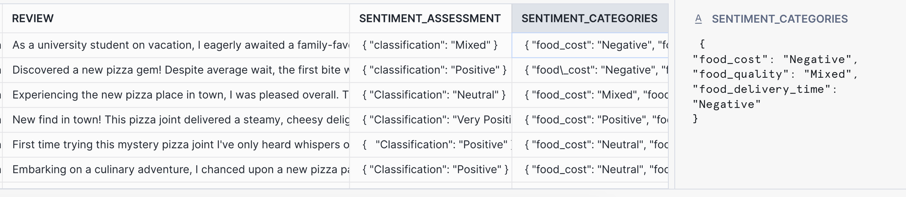
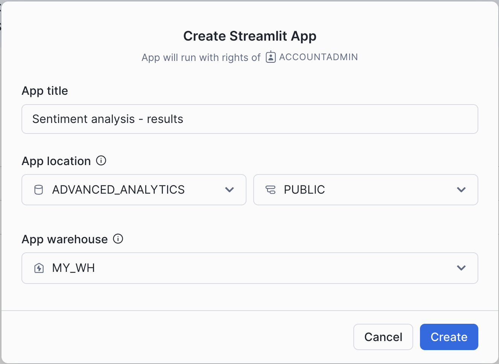
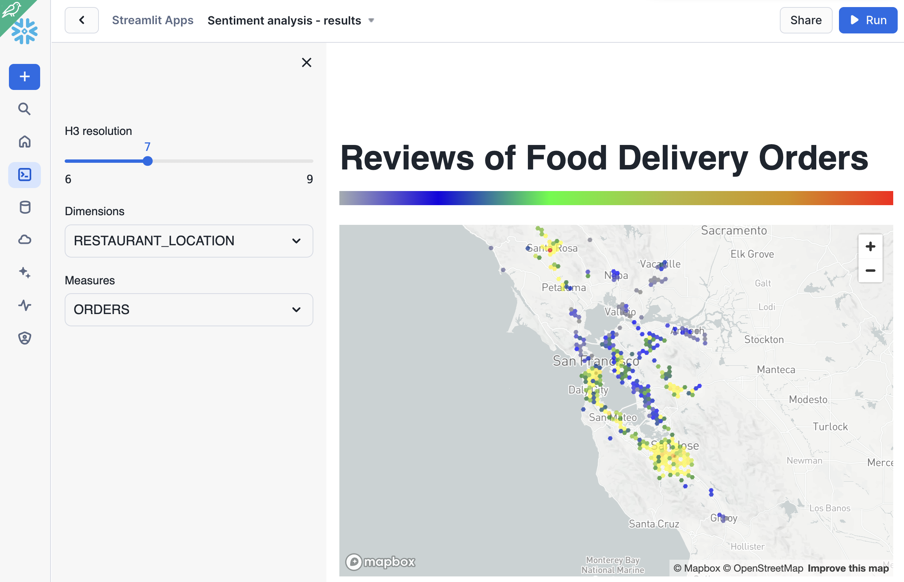
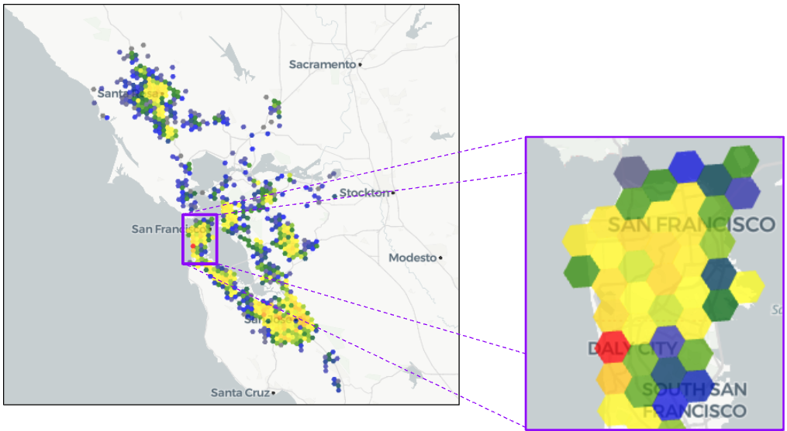
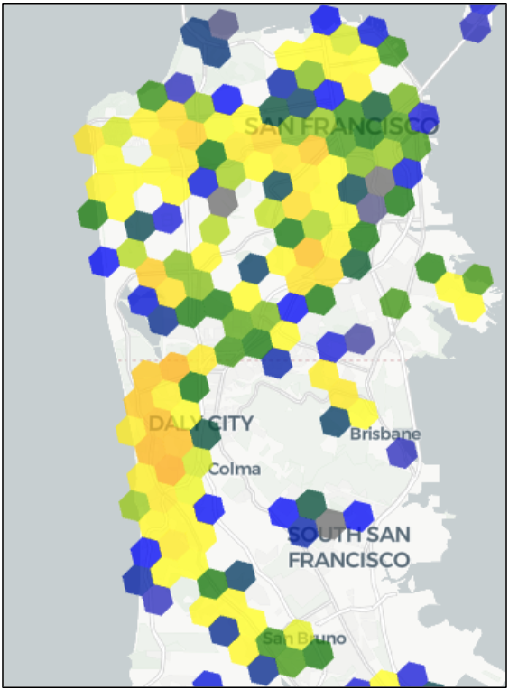
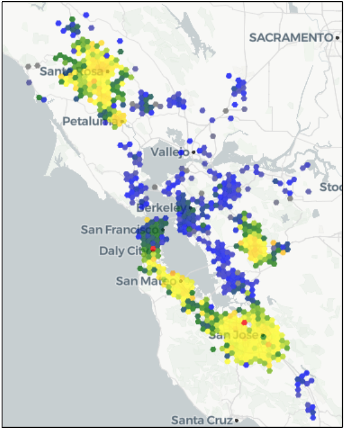
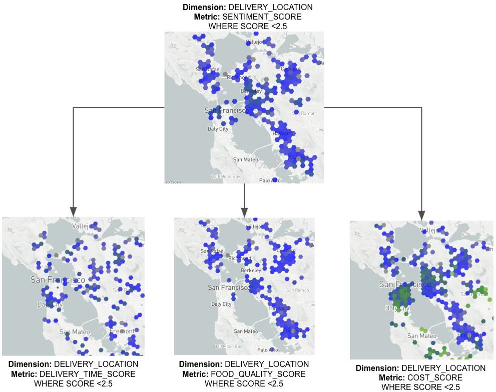

## Customer Reviews Sentiment Analysis

This lab will show you how to inject AI into your spatial analysis using Cortex Large Language Model (LLM) Functions to help you take your product and marketing strategy to the next level. Specifically, you're going to build a data application that gives food delivery companies the ability to explore the sentiments of customers in the Greater Bay Area. To do this, you use the Cortex LLM Complete Function to classify customer sentiment and extract the underlying reasons for that sentiment from a customer review. Then you use the [Discrete Global Grid H3](https://www.uber.com/en-DE/blog/h3/) for visualizing and exploring spatial data.

## Step 1. Data acquisition

To complete the project you will use a synthetic dataset with delivery orders with the feedback for each order. We will simplify the task of data acquisition by putting the dataset in an S3 bucket, which you will connect as an external stage.

First specify the default Database, Schema and the Warehouse and create a file format that corresponds to the format of the trip and holiday data we stored in S3.

Run the following queries:

```sql
-- Set the default database and schema for the current session
USE advanced_analytics.public;

-- Set the virtual warehouse to be used for the session
USE WAREHOUSE my_wh;

-- Create (or replace) a named file format for loading CSV files.
-- This format can be referenced by name in COPY INTO commands.
CREATE OR REPLACE FILE FORMAT csv_format_nocompression
    TYPE = 'CSV'
    FIELD_OPTIONALLY_ENCLOSED_BY = '"'
    FIELD_DELIMITER = ','
    SKIP_HEADER = 1;
```

Now you will create an external stage using S3 with test data:

```sql
CREATE OR REPLACE STAGE aa_stage URL ='s3://sfquickstarts/hol_geo_spatial_ml_using_snowflake_cortex/';
```

Then create a table where you will store the customer feedback dataset:

```sql
CREATE OR REPLACE TABLE advanced_analytics.public.orders_reviews
as
    SELECT $1::NUMBER as order_id,
        2::VARCHAR as customer_id,
        TO_GEOGRAPHY($3) as delivery_location,
        $4::NUMBER as delivery_postcode,
        $5::FLOAT as delivery_distance_miles,
        $6::VARCHAR as restaurant_food_type,
        TO_GEOGRAPHY($7) as restaurant_location,
        $8::NUMBER as restaurant_postcode,
        $9::VARCHAR as restaurant_id,
        $10::VARCHAR as review
    FROM
        @advanced_analytics.public.aa_stage/food_delivery_reviews.csv
    (file_format => 'csv_format_nocompression');
```

Congratulations\! Now you have `Orders_reviews` table containing 100K Orders with reviews.

## Step 2. Preparing and running the prompt

In this step, you will prepare the prompt to run the analysis. For the task at hand, you will use the `CORTEX.COMPLETE()` function because it is purpose-built to power data processing and data generation tasks.  Specifically, using a raw table with reviews you'll create a new table with two additional columns: Overall Sentiment and Sentiment Categories which are composed of two different CORTEX.COMPLETE ( ) prompts. For complex aspect-based sentiment analysis like this, you are going to pick the mixtral-8x7b, a very capable open-source LLM created by Mistral AI.

  * Overall Sentiment assigns an overall rating of the delivery: Very Positive, Positive, Neutral, Mixed, Negative, Very Negative, or other.
  * Sentiment Categories give us richer insights into why the overall rating is based on Food Cost, Quality, and Delivery Time.

As a general rule when writing a prompt, the instructions have to be simple, clear, and complete. For example, you will notice that you clearly define the task as classifying customer reviews into specific categories. It's important to define constraints of the desired output, otherwise the LLM will produce unexpected output. Below, you specifically tell the LLM to categorize anything it is not sure of as Other, and explicitly tell it to respond in JSON format.

```sql
CREATE OR REPLACE TABLE ADVANCED_ANALYTICS.PUBLIC.ORDERS_REVIEWS_SENTIMENT_TEST AS
SELECT
    TOP 10
    -- Standard columns from the source table
    order_id,
    customer_id,
    delivery_location,
    delivery_postcode,
    delivery_distance_miles,
    restaurant_food_type,
    restaurant_location,
    restaurant_postcode,
    restaurant_id,
    review,

    -- Cortex call to classify the overall sentiment of the review
    snowflake.cortex.complete(
        'mixtral-8x7b',
        $$
You are a helpful data assistant. Your job is to return a JSON formatted response that classifies a customer review into one of seven sentiment categories.

Return your classification exclusively in the JSON format: {"classification": "<<value>>"}

<categories>
- Very Positive
- Positive
- Neutral
- Mixed
- Negative
- Very Negative
- Other
</categories>

Use "Other" if you are unsure. Do not use any other classifications. It is very important that you do not return anything but the JSON formatted response.

<review>
$$ || review || $$
</review>

JSON formatted Classification Response:
$$
    ) AS sentiment_assessment,

    -- Cortex call to classify sentiment across specific categories
    snowflake.cortex.complete(
        'mixtral-8x7b',
        $$
You are a helpful data assistant. Your job is to classify a customer review across three specific categories. If you are unsure about a category, return null for its value.

For each category, classify the sentiment as one of the following:
- Very Positive
- Positive
- Mixed
- Neutral
- Negative
- Very Negative

Respond exclusively in the following JSON format:
{
  "food_cost": <<value>>,
  "food_quality": <<value>>,
  "food_delivery_time": <<value>>
}

<review>
$$ || review || $$
</review>

JSON formatted response:
$$
    ) AS sentiment_categories
FROM
    ADVANCED_ANALYTICS.PUBLIC.ORDERS_REVIEWS;
```

If you look inside of `advanced_analytics.public.orders_reviews_sentiment_test` you'll notice two new columns: `sentiment_assessment` and `sentiment_categories` `sentiment_assessment` contains overall assessment of the sentiment based on the review and `sentiment_categories` has an evaluation of each of three components individually: cost, quality and delivery time.



Now when you see that the results stick to the expected format, you can run the query above without the `top 10` limit. This query might take some time to complete, so to save time for this quickstart we've ran it for you in advance and stored results which you can import into new table by running following two queries:

```sql
-- Define the table structure for storing order and review data
CREATE OR REPLACE TABLE ADVANCED_ANALYTICS.PUBLIC.ORDERS_REVIEWS_SENTIMENT (
    ORDER_ID               NUMBER(38,0),
    CUSTOMER_ID            VARCHAR,
    DELIVERY_LOCATION      GEOGRAPHY,
    DELIVERY_POSTCODE      NUMBER(38,0),
    DELIVERY_DISTANCE_MILES FLOAT,
    RESTAURANT_FOOD_TYPE   VARCHAR,
    RESTAURANT_LOCATION    GEOGRAPHY,
    RESTAURANT_POSTCODE    NUMBER(38,0),
    RESTAURANT_ID          VARCHAR,
    REVIEW                 VARCHAR,
    SENTIMENT_ASSESSMENT   VARCHAR,
    SENTIMENT_CATEGORIES   VARCHAR
);

-- Load data into the table from a staged CSV file
COPY INTO ADVANCED_ANALYTICS.PUBLIC.ORDERS_REVIEWS_SENTIMENT
FROM @advanced_analytics.public.aa_stage/food_delivery_reviews.csv
FILE_FORMAT = (FORMAT_NAME = csv_format_nocompression);
```

## Step 3. Data transformation

Now when you have a table with sentiment, you need to parse JSONs to store each component of the score into a separate column and convert the scoring provided by the LLM into numeric format, so you can easily visualize it. Run the following query:

```sql
CREATE OR REPLACE TABLE advanced_analytics.public.orders_reviews_sentiment_analysis AS
SELECT * EXCLUDE (food_cost, food_quality, food_delivery_time, sentiment),

    -- Convert sentiment text to a numerical score
    CASE
        WHEN sentiment = 'very positive' THEN 5
        WHEN sentiment = 'positive'    THEN 4
        WHEN sentiment IN ('neutral', 'mixed') THEN 3
        WHEN sentiment = 'negative'    THEN 2
        WHEN sentiment = 'very negative' THEN 1
        ELSE NULL
    END AS sentiment_score,

    -- Convert food cost sentiment to a numerical score
    CASE
        WHEN food_cost = 'very positive' THEN 5
        WHEN food_cost = 'positive'    THEN 4
        WHEN food_cost IN ('neutral', 'mixed') THEN 3
        WHEN food_cost = 'negative'    THEN 2
        WHEN food_cost = 'very negative' THEN 1
        ELSE NULL
    END AS cost_score,

    -- Convert food quality sentiment to a numerical score
    CASE
        WHEN food_quality = 'very positive' THEN 5
        WHEN food_quality = 'positive'    THEN 4
        WHEN food_quality IN ('neutral', 'mixed') THEN 3
        WHEN food_quality = 'negative'    THEN 2
        WHEN food_quality = 'very negative' THEN 1
        ELSE NULL
    END AS food_quality_score,

    -- Convert delivery time sentiment to a numerical score
    CASE
        WHEN food_delivery_time = 'very positive' THEN 5
        WHEN food_delivery_time = 'positive'    THEN 4
        WHEN food_delivery_time IN ('neutral', 'mixed') THEN 3
        WHEN food_delivery_time = 'negative'    THEN 2
        WHEN food_delivery_time = 'very negative' THEN 1
        ELSE NULL
    END AS delivery_time_score

FROM
    -- Subquery to parse sentiment fields from the raw JSON
    (
        SELECT
            order_id,
            customer_id,
            delivery_location,
            delivery_postcode,
            delivery_distance_miles,
            restaurant_food_type,
            restaurant_location,
            restaurant_postcode,
            restaurant_id,
            review,
            try_parse_json(LOWER(sentiment_assessment)):classification::VARCHAR AS sentiment,
            try_parse_json(LOWER(sentiment_categories)):food_cost::VARCHAR AS food_cost,
            try_parse_json(LOWER(sentiment_categories)):food_quality::VARCHAR AS food_quality,
            try_parse_json(LOWER(sentiment_categories)):food_delivery_time::VARCHAR AS food_delivery_time
        FROM
            advanced_analytics.public.orders_reviews_sentiment
    );
```

## Step 4. Data visualization

In this step, you will visualize the scoring results on the map. Open `Projects > Streamlit > Streamlit App` . Give the new app a name, for example `Sentiment analysis - results`, and pick `ADVANCED_ANALYTICS.PUBLIC` as an app location.



Click on the packages tab and add `pydeck` and `branca` to the list of packages as our app will be using them.


Then copy-paste the following code to the editor and click `Run` :

```python
# =============================================================================
# 1. IMPORTS
# =============================================================================
import pandas as pd
import pydeck as pdk
import streamlit as st
import branca.colormap as cm
from snowflake.snowpark.context import get_active_session


# =============================================================================
# 2. CONFIGURATION & CONSTANTS
# =============================================================================
st.set_page_config(layout="centered", initial_sidebar_state="expanded")
COLOR_PALETTE = ["gray", "blue", "green", "yellow", "orange", "red"]
INITIAL_VIEW_STATE = pdk.ViewState(
    latitude=37.633, longitude=-122.284, zoom=7, pitch=50
)


# =============================================================================
# 3. DATA & HELPER FUNCTIONS
# =============================================================================
@st.cache_data
def get_dataframe_from_sql(query: str) -> pd.DataFrame:
    """Executes a SQL query against Snowflake and returns a Pandas DataFrame."""
    session = get_active_session()
    return session.sql(query).to_pandas()


def fetch_h3_data(
    resolution: int, dimension: str, measure: str, score_range: tuple = None
) -> tuple[pd.DataFrame, pd.Series]:
    """
    Fetches and processes H3 hexagon data based on user selections.

    This function dynamically builds a SQL query to aggregate either order counts
    or average sentiment scores, grouped by H3 cell.
    """
    # Determine the aggregation logic and WHERE clause based on the selected measure
    if measure == "ORDERS":
        aggregation_sql = "ROUND(COUNT(*), 2) AS count"
        where_clause = ""
    else:
        aggregation_sql = f"ROUND(AVG({measure}), 2) AS count"
        where_clause = f"WHERE {measure} IS NOT NULL"

    # Build the full SQL query using an f-string for readability
    query = f"""
        SELECT
            H3_POINT_TO_CELL_STRING(TO_GEOGRAPHY({dimension}), {resolution}) AS h3,
            {aggregation_sql}
        FROM
            advanced_analytics.public.orders_reviews_sentiment_analysis
        {where_clause}
        GROUP BY 1
    """
    df = get_dataframe_from_sql(query)
    if df.empty:
        return pd.DataFrame(columns=["h3", "COUNT"]), pd.Series()

    # Calculate quantiles before any filtering
    quantiles = df["COUNT"].quantile([0, 0.25, 0.5, 0.75, 1])

    # Filter the DataFrame by the selected score range if applicable
    if score_range:
        df = df[(df["COUNT"] >= score_range[0]) & (df["COUNT"] <= score_range[1])]

    return df, quantiles


# =============================================================================
# 4. UI & CHARTING FUNCTIONS
# =============================================================================
def render_sidebar() -> tuple:
    """Renders the sidebar controls and returns user selections."""
    with st.sidebar:
        st.header("🗺️ Map Controls")
        h3_resolution = st.slider(
            "Hexagon Resolution (Higher is smaller)", min_value=6, max_value=9, value=7
        )

        selected_dimension = st.selectbox(
            "Location Type:", ("DELIVERY_LOCATION", "RESTAURANT_LOCATION")
        )

        selected_measure = st.selectbox(
            "Metric to Display:",
            ("ORDERS", "SENTIMENT_SCORE", "COST_SCORE", "FOOD_QUALITY_SCORE", "DELIVERY_TIME_SCORE"),
        )

        # Conditionally show the score range slider or the 3D checkbox
        score_range = None
        is_3d_view = False
        if selected_measure != "ORDERS":
            score_range = st.slider(
                "Filter by Score Range:", 0.0, 5.0, (0.0, 5.0)
            )
        else:
            is_3d_view = st.checkbox("Show 3D View", help="Render H3 hexagons in 3D")

    return h3_resolution, selected_dimension, selected_measure, score_range, is_3d_view


def render_pydeck_chart(
    df: pd.DataFrame, quantiles: pd.Series, is_3d_view: bool = False
):
    """Creates and displays the Pydeck map chart."""
    if df is None or df.empty:
        st.warning("No data available for the selected filters.")
        return

    # Create a color map and apply it to the DataFrame
    color_map = cm.LinearColormap(
        COLOR_PALETTE,
        vmin=quantiles.min(),
        vmax=quantiles.max(),
        index=quantiles,
    )
    df["COLOR"] = df["COUNT"].apply(color_map.rgb_bytes_tuple)

    # Define the H3 hexagon layer
    h3_layer = pdk.Layer(
        "H3HexagonLayer",
        data=df,
        get_hexagon="H3",
        get_fill_color="COLOR",
        get_line_color="COLOR",
        auto_highlight=True,
        get_elevation="COUNT / " + str(df["COUNT"].max()) if not df.empty else "0",
        elevation_scale=10000 if is_3d_view else 0,
        pickable=True,
        extruded=True,
    )

    # Set the correct pitch for 2D vs 3D view
    view_state = INITIAL_VIEW_STATE
    view_state.pitch = 50 if is_3d_view else 0

    st.image(
        "https://sfquickstarts.s3.us-west-1.amazonaws.com/hol_geo_spatial_ml_using_snowflake_cortex/gradient.png"
    )

    st.pydeck_chart(
        pdk.Deck(
            map_style="light",# This gives you a light theme
            initial_view_state=view_state,
            tooltip={"html": "<b>Value:</b> {COUNT}", "style": {"color": "white"}},
            layers=[h3_layer],
        )
    )


# =============================================================================
# 5. MAIN APPLICATION
# =============================================================================
def main():
    """Main function to run the Streamlit application."""
    st.title("Food Delivery Order & Sentiment Analysis 🍔")

    # 1. Get user inputs from the sidebar
    resolution, dimension, measure, score_range, is_3d = render_sidebar()

    # 2. Fetch data based on inputs
    df, quantiles = fetch_h3_data(resolution, dimension, measure, score_range)

    # 3. Render the final map
    render_pydeck_chart(df, quantiles, is_3d)


if __name__ == "__main__":
    main()
```

After clicking `Run` button you will see the following UI:



You can start with the overall analysis of the order density. When you select "`DELIVERY_LOCATION`" as a Dimension and "`ORDERS`" as a Measure you'll see what areas correspond to the high number of orders. You can use scale 7 and zoom in to identify clear clusters of where the most deliveries are occurring. In this case you see most deliveries are in Santa Clara, San Jose, and the San Francisco Bay. In particular, the area on the San Francisco peninsula looks to be an area of interest. Zooming in further you can see a dense area of delivery orders. \\



Using a finer H3 resolution, 8 shows how the delivery densities are distributed more finely. From this resolution, you can see the orders are concentrated in Daly City and proceed down to San Bruno. Additionally, in the North, the majority of the orders are coming from the stretch of the Sunset District to the Mission District.



Now that you know where the majority of orders are coming from, let's analyze whether there are interesting differences in customer satisfaction depending on where they are located. Select `DELIVERY LOCATION` as a dimension and `SENTIMENT_SCORE` as a Measure to see the overall sentiment score that the Cortex LLM Complete Function generated. You can notice that the customers are mostly satisfied in the areas of Daly City down to San Jose, in the Santa Rosa area, and around Dublin. You also see that the area between these is mostly showing unhappy customers.



In order to understand why customers in this area are unhappy, you analyze the aspect based sentiment results of the Cortex LLM Complete Function generated for the categories of interest: food cost, delivery time, and the food quality. If you focus purely on the customers that were unhappy, you see that the primary reasons are food quality and food cost getting poor scores. Essentially, the food is not worth the cost and delivery time being fast does not make up for this. Check visualizations using the following combinations of parameters:



If you look at all H3 cells where food quality was high, the average sentiment score is also generally high. Again, you can see there are no cells where customers felt the food quality was above average in the greater Berkeley area. This could indicate either that high quality delivery food is uncommon or that the customers in these areas have higher expectations for delivery food. You can also analyze what areas are getting higher scores for each of the categories and how it correlates with the overall sentiment scores for restaurants in each area.

## Snowflake Employees

Please run the DORA scripts found in: [/config](/config/)

## Clean up;

Now that we’ve completed the work for this hands-on practice, you can clean up the databases by dropping ADVANCEDANALYTICS , CARTO ACADEMY , and PREDICTHQ DEMO . You can also drop the CORTEX USER ROLE and Demand Prediction - model analysis and Sentiment analysis - results Streamlit apps.
